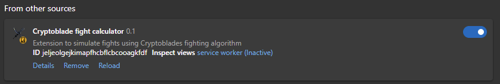

# CryptoBlades fight simulator

This is a Chrome extension that will help you to know the exact win rate percentage you have on each cryptoblades fight.

DISCLAIMER: This is an independent development, I'm not part of the Cryptoblades team and this is not an official tool, if you have doubts you can always check the code :)
## How does it work?

It will automatically collect all the data necessary to simulate a fight:
* Character Power
* Character Element
* Weapon stats (Power, element and LB power)
* Enemy power
* Enemy Element

Then it will simulate 10000 fights and calculate the win rate % of your character against each enemy, showing it in the extension popup

## Installation

This is a Chrome extension currently on development, but it's fully working, to install it you should follow this esteps:

1. Download or clone this repository, it contains all the necessary code for the extension to be installed.
   * If you download as ZIP then you have to unzip it.
2. In your Chrome browser go to: chrome://extensions/
3. Enable the "Developer mode"

the page should look like this:

4. Click in "load unpacked"
5. Select the folder where you downloaded the code

Now it should look like:

##Usage

1. Go to https://app.cryptoblades.io/#/combat
2. Be sure that you have the character bar expanded (The header that shows the character power and level), like this:

3. Once you are in the enemy selection screen, you can use the extension

4. Search your extensions and click in the sword icon to open the popup of the fight simulator, it should like like this:
   

5. Now you just need to click "Fight!", and the extension will automatically simulate 10,000 fights against each enemy to give you the win rate % 

6. Enjoy and **hodl** SKILL :)
   

## Support

I'm a lonely developer who is doing this for fun and to help people make more profit with this awesome game.

if you feel this is making you save time and make more money, you can always support me in different ways:
* Sharing this tool with others
* Starring this repository
* Following me in my social networks "leonardo2rms" in Twitter and Instagram.
* Donating Crypto:
  * SKILL: 0xBb90133f67569738e55C6cB7C9A3F4E9d1f5cF10
  * BNB: 0xBb90133f67569738e55C6cB7C9A3F4E9d1f5cF10
  * XCH (Chia): xch1j00342f9pdmj9n5rvj5ta6lftf72yzdd20d4wusmgyt3wpccqduq6vt977
  * XRP: rEb8TK3gBgk5auZkwc6sHnwrGVJH8DuaLh MEMO:341268141
  * BTC: 1E2W6GvdfeEMHyEPvngzbyJmHmB9oACeQF

## Next versions

This is just the beginning of this tool, I will improve tu UI and add more functionality that can help us make more money and save time while doing so, stay tuned.

